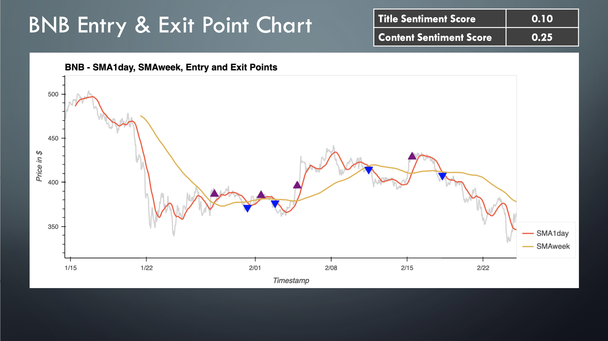

# Project-2-fintech

## Objectives

Leverage prior Project 1 cryptocurrency portfolio dashboard as the starting point and enhance the analysis for the top 6 cryptocurrencies (ETH, BNB, SOL, ADA, & DOT) completing the following:

- Update API to extract historical crypto prices from Binance US exchange.
- Refresh crypto portfolio dashboard with latest historical prices (hourly).
- Extract most relevant news articles for each crypto using the News API.
- Analyze sentiment of each crypto in portfolio using NLTK (VADER).
- Create trading algorithm to track potential entry & exit points for all cryptos.  Analyze each cryptos performance and compare to sentiment.

## Project 2 Outcomes

